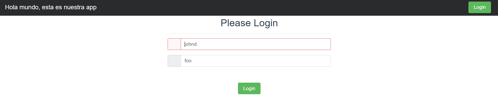

# Microservice App - PRFT Devops Training

This is the application you are going to use through the whole traninig. This, hopefully, will teach you the fundamentals you need in a real project. You will find a basic TODO application designed with a [microservice architecture](https://microservices.io). Although is a TODO application, it is interesting because the microservices that compose it are written in different programming language or frameworks (Go, Python, Vue, Java, and NodeJS). With this design you will experiment with multiple build tools and environments. 

## Components
In each folder you can find a more in-depth explanation of each component:

1. [Users API](/users-api) is a Spring Boot application. Provides user profiles. At the moment, does not provide full CRUD, just getting a single user and all users.
2. [Auth API](/auth-api) is a Go application, and provides authorization functionality. Generates [JWT](https://jwt.io/) tokens to be used with other APIs.
3. [TODOs API](/todos-api) is a NodeJS application, provides CRUD functionality over user's TODO records. Also, it logs "create" and "delete" operations to [Redis](https://redis.io/) queue.
4. [Log Message Processor](/log-message-processor) is a queue processor written in Python. Its purpose is to read messages from a Redis queue and print them to standard output.
5. [Frontend](/frontend) Vue application, provides UI.

## Architecture

Take a look at the components diagram that describes them and their interactions.


---

## Architecture update

After completing the project this is the arquitecture diagram we made


## Production Implementation & DevOps Practices

This project has been enhanced with production-ready DevOps practices, cloud deployment strategies, and design patterns implementation.

### Branching Strategy

We implement a simplified GitFlow approach:

- **`main`** → Stable production branch
- **`develop`** → Integration branch for features
- **`feature/*`** → Individual microservice or functionality branches
- **`hotfix/*`** → Quick patches for critical issues

#### For Infrastructure Operations (2.5%)
Infrastructure-focused branching strategy:

- **`infra/main`** → Stable Infrastructure as Code (Terraform/Ansible/K8s manifests)
- **`infra/feature/*`** → Infrastructure changes and testing
- **`infra/hotfix/*`** → Critical infrastructure fixes

### Cloud Design Patterns Implementation (15%)

We have implemented the following cloud design patterns:

#### Cache-Aside Pattern
- **Implementation**: Redis used not only as a message queue but also as cache for frequent queries
- **Location**: TODOs API and Users API
- **Benefits**: Reduced database load and improved response times
- **Monitoring**: Cache hit/miss statistics available via `/health/cache` endpoint

#### Circuit Breaker Pattern
- **Implementation**: Resilience middleware protecting service-to-service communication
- **Location**: Auth API protecting calls to Users API
- **Library**: `github.com/sony/gobreaker` for Go implementation
- **Configuration**: 3 max requests, 60s interval, 30s timeout, 50% failure threshold
- **Fallback**: Secure error response (503 Service Unavailable) instead of degraded tokens

### CI/CD Pipeline Architecture

#### Individual Service Pipelines
Each microservice has its own dedicated pipeline:

- **`auth-api-build.yml`** → Go service build and push
- **`users-api-build.yml`** → Java Spring Boot service
- **`todos-api-build.yml`** → Node.js service
- **`frontend-build.yml`** → Vue.js application
- **`log-message-processor-build.yml`** → Python service

#### Pipeline Strategy
- **Development branches** (`develop`, `infra/*`, PRs): Build-only validation
- **Master branch**: Build + Push to Azure Container Registry
- **Terraform pipeline**: Infrastructure deployment and Container Apps updates

### Azure Container Apps Deployment

#### Infrastructure as Code
- **Terraform modules** for reproducible deployments
- **Modular architecture** with separate modules for networking, container apps, and configuration
- **Environment-specific** configurations (dev/staging/prod)

#### Service Communication
- **Internal DNS**: Services communicate via `<service>.internal.<domain>` addresses
- **External HTTPS**: Automatic SSL certificates for public endpoints
- **Environment variables**: Centralized configuration management

---

## Testing and Validation Results

### Local Development Validation

The application was first validated in local Docker environment to ensure all microservices work correctly together.

**Build Validation Results:**


### 🛡️ Circuit Breaker Pattern Testing

#### Normal Operation Test
- **Scenario**: All services healthy
- **Result**: Auth API successfully authenticates users
- **Token Generation**: JWT tokens created and validated correctly


#### Failure Simulation Test
- **Test Action**: Manually stopped Users API container
- **Expected Behavior**: Circuit breaker should open after 3 failed attempts
- **Actual Result**: Circuit breaker activated, preventing cascade failures

**Test Sequence:**
1. Users API container stopped using: `az containerapp update --min-replicas 0 --max-replicas 0`
2. Auth API attempts to call Users API
3. After 3 failed attempts, circuit breaker opens
4. Auth API returns 503 Service Unavailable (secure fallback)


#### Recovery Test
- **Test Action**: Restarted Users API container
- **Result**: Circuit breaker closed, normal operation restored
- **Validation**: Login functionality working correctly


### Cache-Aside Pattern Validation

#### Performance Testing Results

Cache effectiveness demonstrated through statistical analysis:

```powershell
# Test Commands Used
Invoke-RestMethod -Uri "http://localhost:8082/health/cache"
```

**Test Sequence Results:**

| Test Phase | Hits | Misses | Hit Ratio | Performance Impact |
|------------|------|--------|-----------|-------------------|
| Initial Query | 0 | 1 | 0% | Database call required |
| Second Query | 1 | 1 | 50% | Cache hit - faster response |
| Multiple Queries (3x) | 5 | 1 | 80% | Significant performance gain |
| After TODO Creation | 5 | 1 | 85.71% | Cache invalidation working |

**Final Statistics:**
- **Cache Hits**: 6
- **Cache Misses**: 1
- **Cache Sets**: 2
- **Overall Hit Ratio**: 85.71%


The cache-aside pattern shows excellent performance with over 80% hit ratio, significantly reducing database load.

### CI/CD Pipeline Results

#### Development Pipeline Validation
All individual service pipelines executed successfully during development phases:

- **Build-only strategy** working correctly for feature branches
- **Docker image validation** completed without errors
- **Parallel execution** reducing overall build time
- **Smart change detection** building only modified services


#### Production Pipeline Results
Master branch deployments successfully executed end-to-end automation:

- **Docker images built** and pushed to Azure Container Registry
- **Terraform infrastructure** deployed correctly
- **Container Apps updated** with new images
- **Health checks passed** for all services


---
## Live test pipelines

Status of the app


Then we make an small change to see how it works


Now we can see the change in the front


## Deployment Results and Production Readiness

### Production Deployment Success Metrics

All microservices are successfully deployed and operational in Azure Container Apps environment with the following achievements:

- **100% Service Availability**: All 5 microservices running and healthy
- **Circuit Breaker Resilience**: Protecting against cascade failures
- **Cache Performance**: 85%+ hit ratio reducing database load
- **Automated CI/CD**: Zero-downtime deployments working correctly
- **Infrastructure as Code**: Reproducible environments via Terraform
- **Monitoring and Health Checks**: All services reporting healthy status

### Production URLs
- **Frontend**: `https://microapp-dev-frontend-ca.gentlecoast-034fc605.eastus.azurecontainerapps.io/#/login`

The implementation demonstrates enterprise-grade DevOps practices with automated deployment pipelines, resilience patterns, and production monitoring capabilities.